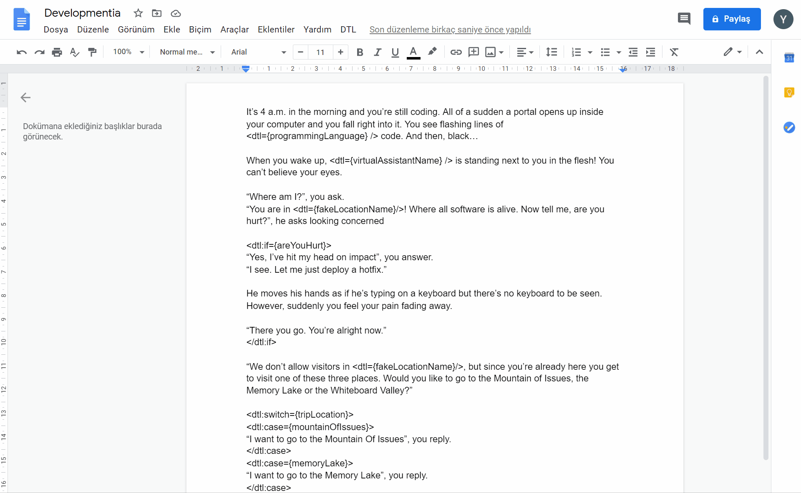

<h1 align="center">
  <br>
  Docs Templating Language
  <br>
</h1>

<p align="center">
<a href="https://github.com/google/clasp"></a>


<a href="https://github.com/YTolun/dtl/blob/master/LICENSE"></a>
</p>
<p align="center">
<a href="https://twitter.com/ytolun"></a>
</p>

> Create flexible templates for Google Docs and generate instances of your templates using a sidebar GUI



## Table of Contents

- **[Features](#features)**<br>
- **[Usage](#usage)**<br>
- **[Syntax](#syntax)**<br>
  - **[Variables](#Variables)**<br>
  - **[If Statements](#if-statements)**<br>
  - **[Switch Statements](#switch-statements)**<br>
- **[Known Issues](#known-issues)**<br>
- **[License](#license)**<br>

## Features

**🔤 Variables:** Define variables and replace them with strings using _text inputs_ in the GUI

**✅ If Statements:** Define conditional blocks of content in your document and show/hide them using _checkboxes_ in the GUI

**💱 Switch Statements:** Define conditional blocks of content for more than two scenarios and show/hide them using _dropdowns_ in the GUI

**🖇Nesting:** You can use variables inside of if or switch statements

**💫 Flexible:** DTL can be used to create anytype of document template you want

## Usage

As of now, DTL isn't published as an add-on. So you need to create your own Apps Script project by copying this file.

### Clone the project

```
git clone https://github.com/YTolun/dtl.git
```

### Create a Google Doc file

Create a Google Doc file in youy Drive and open the **Script Editor** by going to _Tools > Script Editor_

### Change Script Id in the cloned project

To learn the Script Id of your newly created Google Doc, open the Script Editor and go to _File > Project Properties_

Copy the Script Id of your Google Doc and change `/.clasp.json` accordingly.

## Install clasp

Please follow the instructions on [clasp README](https://github.com/google/clasp) to install clasp, log into it and turn on your Apps Script API.

### Push the code to your project

Run

```
clasp push
```

Now when you open your Google Doc, you'll see the DTL item on the menu.

## Syntax

You can use this JSX-inspired syntax anywhere in your document to manipulate your template using the generated sidebar UI.

### Variables

Variables control _string_ values and they're represented by _text inputs_ in the GUI. There are two ways of defining a variable in DTL.

Regular print tag:

```
<dtl:print={variableName} />
```

Shorthand tag (better suited for inline usage):

```
<dtl={variableName} />
```

### If Statements

If statements control _blocks of elements_ that you wish to show or hide depending on a _boolean_ variable. If statements are represented by _checkboxes_ in the GUI.

If statement syntax:

```
<dtl:if={booleanName}>
    This block of text will only be included in the generated copy of the document
    if the booleanName is set to true ✔
</dtl:if>
```

Currently, DTL doesn't support using inline if statements.

### Switch Statements

Switch statements are used to include one of two or more _blocks of elements_ based on a _case_ choice. Switch statements are represented by _dropdowns_ of possible case values in the GUI.

Swtich statement syntax:

```
<dtl:switch={switchName}>
    <dtl:case={optionOne}>
        This block of text will only be included in the generated copy of the document
        if optionOne is selected as switchName
    </dtl:case>
    <dtl:case={optionTwo}>
        This block of text will only be included in the generated copy of the document
        if optionTwo is selected as switchName
    </dtl:case>
    <dtl:case={optionThree}>
        This block of text will only be included in the generated copy of the document
        if optionThree is selected as switchName
    </dtl:case>
</dtl:switch>
```

Currently, DTL doesn't support using inline switch statements.

## Known Issues

### Last element of a document can't be a variable, an if statement or a switch statement

You need at least one empty line or a line of regulat text (that doesn't use DTL) at the end of your document. This issue is caused by an Apps Script limitation.

## License

This project is licensed under the MIT License. For further information, please check the [LICENSE file](LICENSE).
